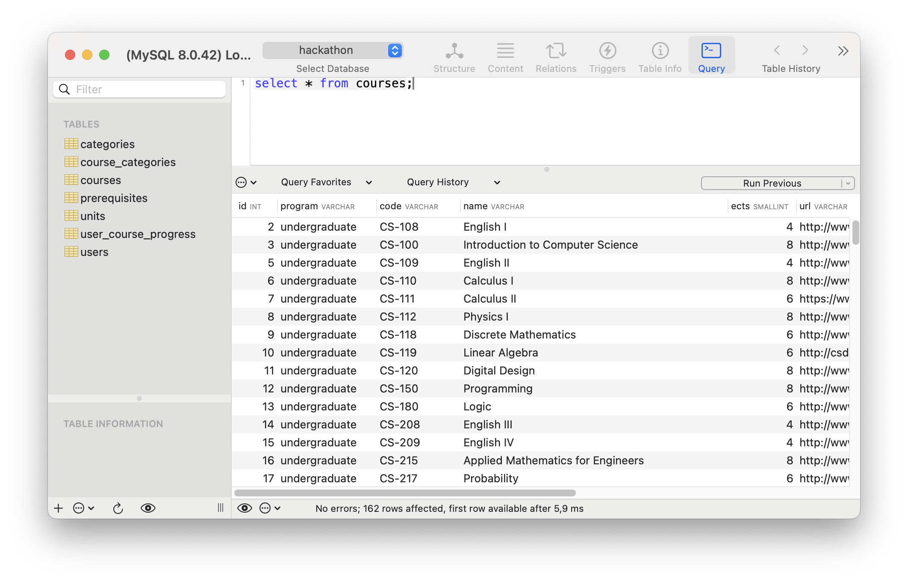

# FuturEd AI Hackathon 2025

Collaborate and innovate for 2 days, and unleash AI's potential for education!

Develop innovative, AI-driven solutions that revolutionize education by creating personalized, accessible, and engaging
learning experiences. Participants are tasked with leveraging artificial intelligence to address real educational
problems, from personalized learning companions and real-time knowledge gap identification to adaptive visualization and
improved accessibility, ultimately shaping a future where education is more effective and equitable for all.

## When
2 - 3 Oct 2025

## Where
Computer Science Department - University of Crete\
Voutes Campus\
70013 Heraklion Crete, Greece

# About this repo

This repository contains the code for the API of the hackathon. It is built using NestJS and LangChain.

Everything is contained in the `api` folder. The idea is to follow a "monorepo" pattern, where the entire solution is
under a single repo and different folders contain different parts of the solution. To this end the `api` folder
represents the "backend" implementation of the solution providing a Restfull API. Please feel free to expand/alter
the code and structure to fit your specific requirements and approach.

## Pre-requisites

On the software side you just need [Docker](https://www.docker.com/).

On the AI side we will be utilizing **Amazon Bedrock**, a fully managed service that makes foundation models (FMs) from
leading AI companies available via an API.

On the config side, you will need to copy the `.env.example` file to `.env` in the `api` folder and fill in with the
provided values.

```
AWS_ACCESS_KEY_ID=""
AWS_SECRET_ACCESS_KEY=""
AWS_SESSION_TOKEN=""
```

## Start docker, install Nest

The following commands will start a Docker container with the latest Node.js and install the NestJS CLI globally.

```
docker run -it --rm -p 3000:3000 -v "$(pwd):/app" -w /app node:latest bash
npm i -g @nestjs/cli
```

## Run the API

Inside the docker container, run the following commands to install the dependencies and start the API.

```
cd api/
npm install
npm run start:dev --env-file .env
```

The API schema is available at http://localhost:3000/schema

You can also change the provided synthetic data available at the `api/data` folder.

The API provides the following services:
- **Prompt**: A service that generates a response based on a given prompt.
- **Stream**: A service that generates a response based on a given prompt and streams the response back to the client.
- **Chat**: A chat interface that allows you to interact with the AI model in a conversational way.
- **Embeddings**: A service that generates embeddings for a given text.
- **RAG**: A service that uses the AI model, embeddings, and vector store to provide relevant information based on a
query.

## GenAI

```
curl -vv "http://localhost:3000/genai/prompt?message=What+is+the+capital+of+Greece"
curl -N -vv "http://localhost:3000/genai/stream?message=Explain+to+me+the+theory+of+relativity+in+two+paragraphs"
```

Message part1:
```
{
	"messages": [
		{
			"type": "Human",
			"text": "Hi, my name is Vassilis and I will be joining FuturEd AI hackathon event on the 2nd of October 2025!"
		}
	]
}
```

Message part2:
```
{
	"messages": [
		{
			"type": "Human",
			"text": "Hi, my name is Vassilis and I will be joining FuturEd AI hackathon event on the 2nd of October 2025!"
		},
		{
			"type": "System",
			"text": "Hello Vassilis! It's great to hear that you'll be participating in the FuturEd AI hackathon event on October 23, 2025. Hackathons are excellent opportunities to collaborate, learn, and showcase your skills in artificial intelligence and technology.

As the event is still in the future, here are some general tips to help you prepare:

1. Brush up on your AI and programming skills.
2. Stay updated on the latest AI trends and technologies.
3. Consider forming a team or connecting with potential teammates beforehand.
4. Think about possible project ideas that align with the hackathon's theme (if announced).
5. Ensure you have all the necessary tools and software installed on your devices.

Remember to check the event's official website or communication channels closer to the date for any specific instructions or updates. Good luck with your preparations, and I hope you have a great experience at the hackathon!"
		},
		{
			"type": "Human",
			"text": "When will the FuturEd AI take place?"
		}
	]
}
```

```
curl -H "Content-Type: application/json" --data @<filename>.json http://localhost:3000/genai/chat
```

## Embeddings
```
curl -vv "http://localhost:3000/genai/embeddings?message=What+is+the+capital+of+Greece"
```

## RAG (GenAI, embeddings, vector store and the glue to make it work)
```
curl -vv "http://localhost:3000/genai/rag?message=Did+the+Queen+turned+purple"
```
# Dataset

We have prepared a synthetic dataset that you can use for your project (part synthetic, part actual data from the course catalog of CSD). The dataset is in SQL format (MySQL dump file) and is located at `api/data/dataset.sql`.


# Resources
- [NestJS](https://nestjs.com/)
- [LangChain](https://js.langchain.com/docs/tutorials/)